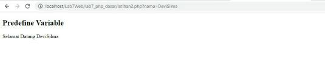

## DEVI SILMA YUNIAR
## TI.20.A2

## 1. instal Xampp


install xampp 

## 2. Menjalankan web server


Menjalankan web server

## 3. Memulai PHP


folder htdoc php dasar


## 4. PHP dasar


Memulai PHP dasar seperti gambar diatas

**code**

```php
<!DOCTYPE html>
<html lang="en">
<head>
<meta charset="UTF-8">
<title>PHP Dasar</title>
</head>
<body>
<h1>Belajar PHP Dasar</h1>
<?php
echo "Hello World";
?>
</body>
</html>
```

## 5. variable PHP


Mendeklarasikan variable dalam Php

**code**

```php
<?php
$nim = "0411500400";
$nama = 'Abdullah';
echo "NIM : " . $nim . "<br>";
echo "Nama : $nama";
?>
```

## 6. Predefine $_GET


Mendeklarasikan variable predefine $_GET

**Code**

```php
<?php
echo 'Selamat Datang ' . $_GET['nama'];
?>
```

## 7. Membuat form Input

